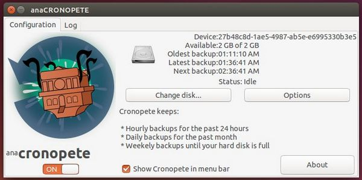

# CRONOPETE

A backup utility for Linux.

Cronopete is a backup utility for Linux, modeled after Apple's
Time Machine. It aims to simplify the creation of periodic
backups.

## BUILDING CRONOPETE

To build Cronopete, you need to install CMAKE and Vala-0.22

Now, type

    mkdir BUILD
    cd BUILD
    cmake ..
    make
    sudo make install

This will compile Cronopete with AppIndicator support.

There is one modifier for "cmake" that allows to change the compilation
options:

    NO_APPINDICATOR will compile cronopete without the libappindicator library

This modifier must be prepended with "-D", and appended with "=on".
To use this modifier, first remove all the contents in the BUILD folder,
and run again cmake. This will compile cronopete without libappindicator
library:

    cd BUILD
    rm -rf *
    cmake .. -DNO_APPINDICATOR=on
    make
    sudo make install

### Ubuntu 14.04 LTS

Instructions to build a DEB for Ubuntu 14.04 LTS:

    sudo apt-get install libgee-0.8-dev libgsl0-dev libgtk-3-dev libudisks2-dev libappindicator3-dev valac cmake make
    make -f debian/rules clean build binary

To install the DEB:

    sudo dpkg -i ../cronopete_3.20.2-Debian1_amd64.deb

To get Cronopete to run on login:

    gnome-session-properties

Add a new startup application "Cronopete" and set the command to "/usr/bin/cronopete".

## CONTACTING THE AUTHOR

Sergio Costas Rodriguez (Raster Software Vigo)

    raster@rastersoft.com

http://www.rastersoft.com

GIT: git://github.com/rastersoft/cronopete.git
